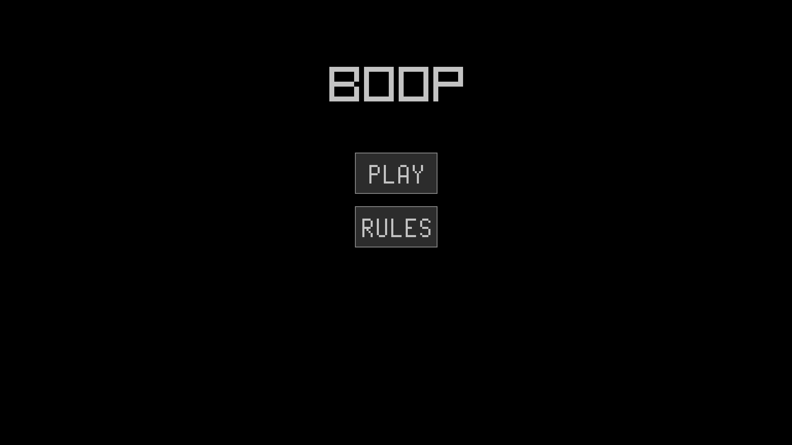
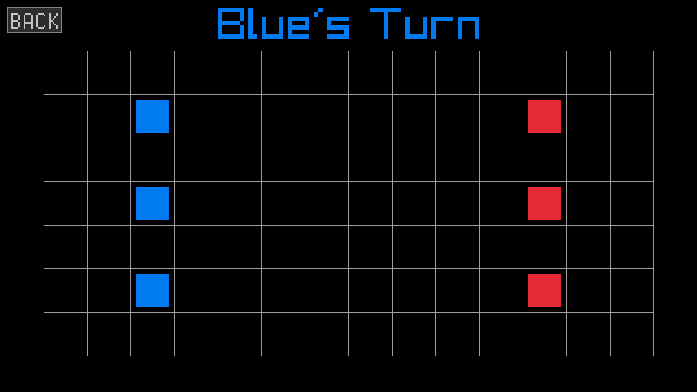
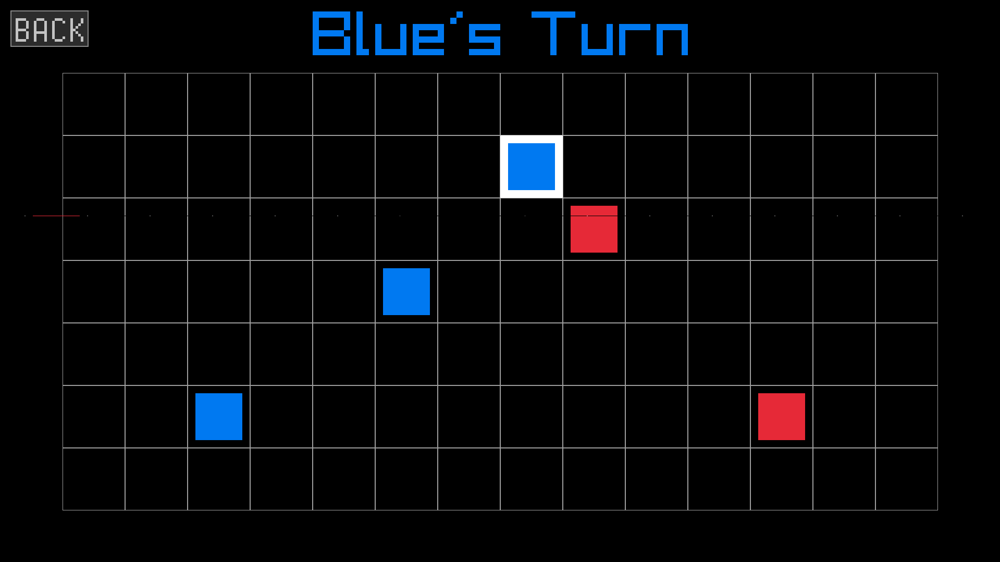
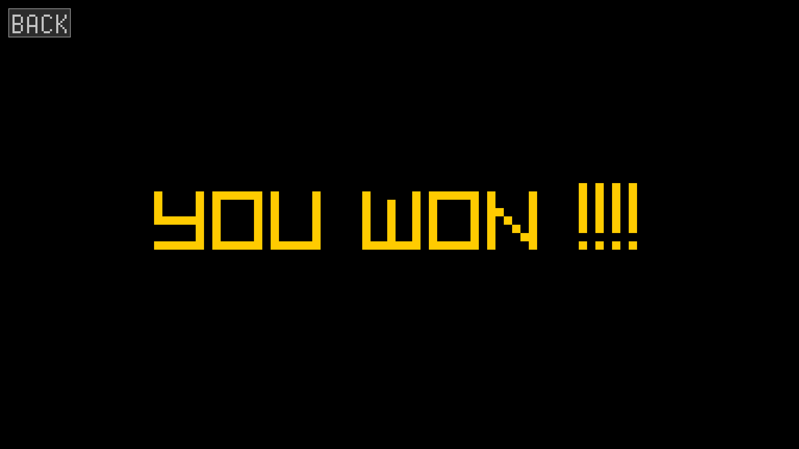

# BOOP

It is a minimalist , tactical grid game built from scratch in cpp using [Raylib](https://www.raylib.com)

The blue pieces is the player itself and the red ones are the opponents which is a bot.

## Features
* the game has a grid of 14 x 7
* 3 pieces of each team are mapped over the grids 
* the ai constantly approaches the player pieces during its turn.
* it follows a turn based mechanism
* uses Raygui for dark mode and clean interface.

## Requirments

* [Raylib](https://github.com/raysan5/raylib)
* [RayGUI](https://github.com/raysan5/raygui)
* A C++ compiler

## How to Play 

* Select the blue piece you want to move 
* place it a distance of maximum one block to move
* if in contact with any red piece , click over it to boop the piece(kill)
* only one action per turn , boop or move.

## Compile cmd using g++(Windows)
> g++ .\main.cpp -o gane.exe -I"[head file location]" -L"[library file location]" -lraylib -lopengl32 -lgdi32 -lwinmm

>.\game.exe

## To build the game on other deivces 

### Linux(g++)
>g++ main.cpp -o game -I"[head file location]" -L"[library file location]" -lraylib -lGL -lm -lpthread -ldl -lrt -lX11

>./game

### macOS(clang++)
>clang++ main.cpp -o game -I$(brew --prefix raylib)/include -L$(brew --prefix raylib)/lib -lraylib -framework OpenGL -framework Cocoa -framework IOKit -framework CoreVideo

>./game

## Game Screenshots

](image.png)

